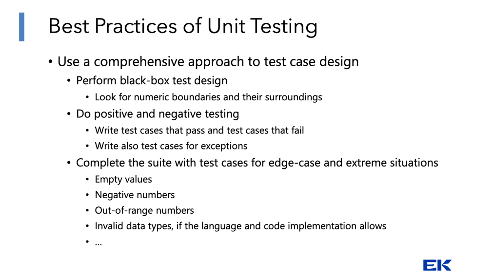
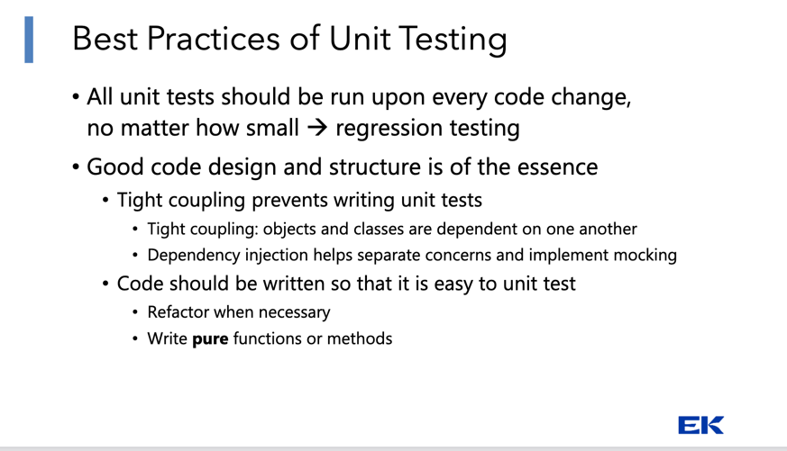
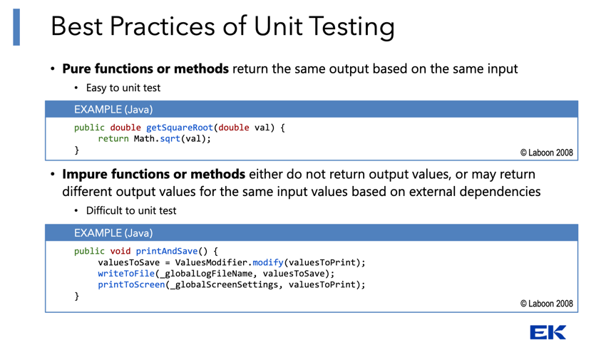
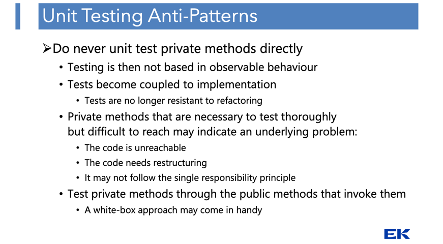
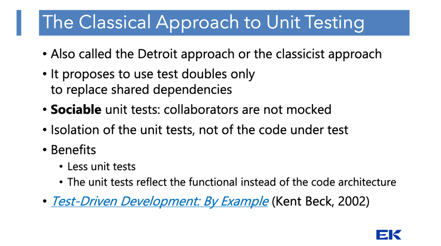
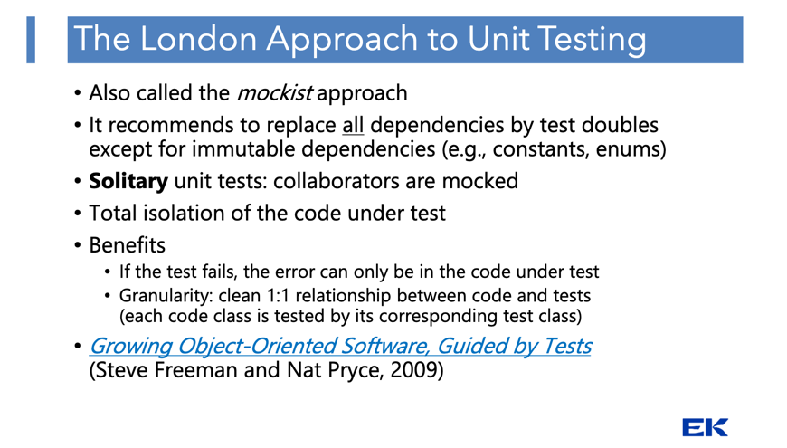
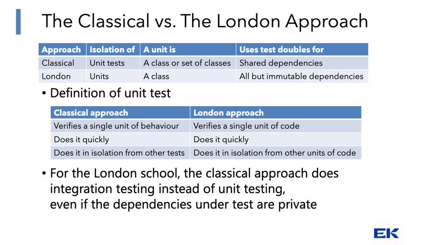
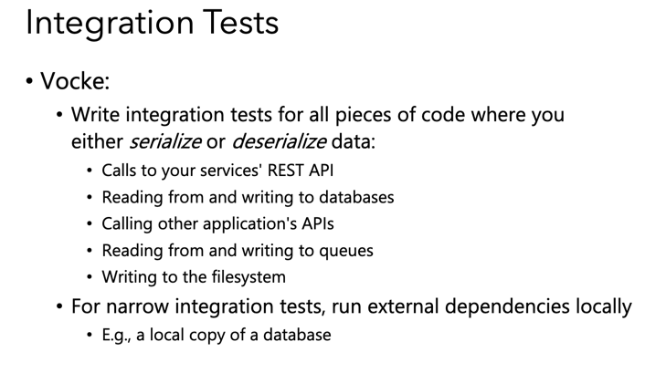
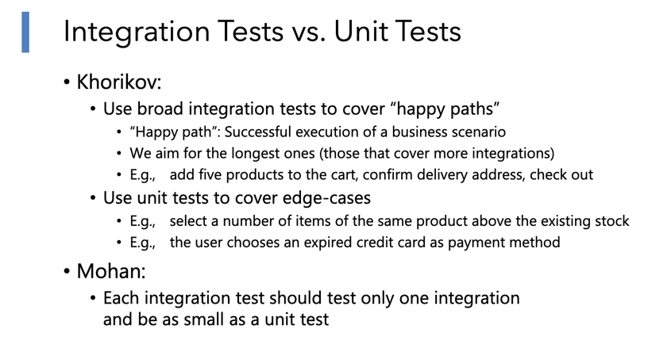
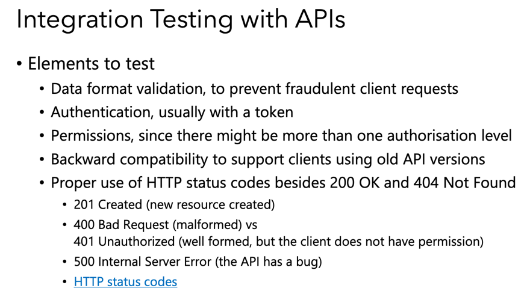

# Software Dev - Testing - Notes & Misc 👩‍🔬

## Quality Management = Quality Assurance + Quality Control

**Quality Assurance (QA) - Proactive**

- Making sure that processes are undertaken correctly

**Quality Control (QC). Reactive**

- Making sure that the desired level of quality is achieved
    - _Testing_ - Enforcement of quality control by finding defects in a product

---

# Verification vs Validation

**Verification** - Checks that the work product meets the requirements

- Mostly a technical activity
- Verification ensures that we are building the product the right way

**Validation**

- Evaluates the work product against user needs
- Usually requires business knowledge
- Validation checks that we are building the right product

---

<br>

# Testing strategies

For _unit tests_ all values have to be hardcoded.

## Positive vs Negative Tests

- **Positive Tests:** Verify expected behavior with valid inputs (happy path).
- **Negative Tests:** Verify error handling and graceful degradation with invalid or unexpected inputs.

---

## Static Testing

Testing the code without it being executed.
Could be the IDE highlighting errors - looking at the code / reviewing the code / AI analyzing code.

---

<br>

## Unit Testing ⚖️

### Best Practices for Unit Testing ✅





---

### Anti-Patterns for Unit Testing 🛑

_(Check PP - **Unit Testing Best Practices and Anit-Patterns**)_



---

## Detroit Approach

No mocking is allowed



## London Approach

Everything is mocked



### Comparing Detroit with London



---

<br>

## Integration Test

Integration testing checks whether different parts of your system work together correctly.
Unlike unit tests, which isolate single components, integration tests exercise multiple layers
(e.g., controllers + models + database, or service + API + queue)
through their public interfaces, not their internals.
The goal is to validate real-world behavior across boundaries,
ensuring that data flows, dependencies, and interactions between components function as expected.





### Testing API's with Integration Tests



---

<br>

## Black Box vs White Box Testing

- **Black Box** (specification-based) - Based on the test basis

- **White Box** (structure-based) - Focused on the code or other structural elements
    - Experience-based

### Black Box Testing

**Based on specifications**

- _Requirements_
- _Architecture_
- _Technical_
- _Testing scope: what to do (specifications), not how to do it (internal design)_
- _They can be applied to all test levels_
    - Unit tests
    - Integration tests
    - System tests
    - Acceptance tests

#### Black-box Techniques

1. **Equivalence Partitioning**
    - Similar inputs can be grouped together(_positive integers_, _alphabetic characters_)
    - Any partition value can be used for testing (often a middle value)
    - Numbers: zero is a special case that may constitute a partition of its own
    - Input partitions
        - Based on input values

---

2. **Boundary Value Analysis**
    - Partitions have boundaries
    - Errors tend to cluster around boundaries
    - _Three point boundary value problem_ - _Three-point boundary value test_: lower bound, upper bound, and exact
      boundary value
    - Terms such as Lower boundary & Upper Boundary & Boundaries and their surroundings
    - Mostly based on:
        - _>vs >=_
        - _> <vs <=_
        - _> Loops. E.g.:_
            - for (i = 0; i < total; i++)
            - for (i = 1; i < total; i++)for (i = 0; i <= total; i++)
            - for (i = 1; i <= total; i++)
        - It works well in combination with equivalence partitioning

3-value boundary analysis

---

3. **Decision Table Testing**
    - Specifications often contain business rules to define the functions and conditions
    - Assessing the combination of these business rules can become complex
    - Assessment must be comprehensive

### Input form Example for Decision Table Design

An input form has two textboxes ("Username" and "Password"). Access to the homepage will be granted only if both fields
are correct. Represent the situation in a decision table.

#### Solution

|                  | R1 | R2 | R3 | R4 |
|------------------|----|----|----|----|
| **Conditions**   |    |    |    |    |
| Username correct | F  | T  | F  | T  |
| Password correct | F  | F  | T  | T  |
| **Actions**      |    |    |    |    |
| Go to homepage   | N  | N  | N  | Y  |

Reduced solution:

|                  | R1 | R2 | R3 |
|------------------|----|----|----|
| **Conditions**   |    |    |    |
| Username correct | F  | -  | T  |
| Password correct | -  | F  | T  |
| **Actions**      |    |    |    |
| Go to homepage   | N  | N  | Y  |

---

4. **State Transition Testing**

* Particularly suited for systems where outputs are triggered by changes to the input conditions or changes of state
    * Usual in hardware devices (e.g., washing machine, elevator)
* Behaviour depends on:
    * Current state
        * Past state
        * Transition from past to current state
* **_State Transition Diagram_**. Symbols:
    * State. Only changes if stimulated by event
    * Transition. Change from one state to another. Labelled with the name of:
        * The event that caused the change or the precondition for it
        * The action that arises from the change
    * Events may generate an output or change the system’s internal state

---

### White Box Testing

Most important is that white-box testing is focused on the code or other structural elements.

#### Statement coverage / test coverage / code coverage

- It focuses on covering all executable code statements

- Measure: percentage of executable lines of code tested

**Statement coverage is achieved when all executable statements—including conditionals, loops, and switches—are executed
at least once.**

```javascript
function higherNumber(numbers) {
    lethigher = -1;
    numbers.forEach(element => {
        if (element > higher) {
            higher = element;
        }
    });
    returnhigher;
}

/*Test cases for 100% statement coverage-#1. Values: [1] Any array with at least one number*/
```

---

#### Decision Coverage

- Also called **branch coverage**
- Every decision outcome (branch) must be tested at least once
- This means testing _else_ conditions with no associated code
- 100% decision coverage guarantees 100% statement coverage, but not the other way around

```javascript
function higherNumber(number1, number2, number3) {
    lethigher = number1;
    if (number2 > higher) {
        higher = number2;
        if (number3 > higher) {
            higher = number3;
        }
    }
    returnhigher;
}

/* 
Test cases for 100% decision coverage 
    - #1. Values: 1, 2, 3 (both ifs)        Path: a b
    - #2. Values: 1, 3, 2 (inner else)      Path: a c
    - #3. Values: 3, 1, 2 (outer else)      Path: d
*/
```

---

#### Statement vs Decision Coverage

Statement coverage ensures every statement runs at least once,
while decision coverage ensures every branch of conditionals (if/else) is tested.
For else if without else, statement coverage may pass even if some branches never execute,
but decision coverage will catch them.

---

<br>

## Doubles

A stand in for DB, Library, or similar type of third-part dependency.

`“A generic term for any case where you replace a production object for testing purposes”` (Martin Fowler)

- Fake objects that substitute other objects in the codebase
- They allow to•Test a unit in total isolation
- Substitute components not yet developed
- Speed up test execution© Pixabay at Pexels

---

## Mock

Outgoing interactions (e.g., an email service)

---

## Stub

Incoming interactions (e.g., an external API)

---

<br>

# End-to-End Testing

)

---

<br>

# Certifications

`International Software Testing Qualifications Board`

The _ISTQB_ is a global organization that offers standardized qualifications for software testers and QA professionals.

_Gemini's take on ISTQB_

```text
ISTQB certification, from the International Software Testing Qualifications Board,
is an internationally recognized credential for software testing and quality assurance (QA) professionals.
It validates knowledge and skills across different levels (Foundation, Advanced, Expert), specializations (Agile, AI, Security), and roles.
The certification is vendor-neutral and provides a strong foundation in testing principles,
practices, and terminology, which can enhance a professional's career profile and portability.
```

---

<br>

# Tools

**_Ruby oriented tools_**

- **RuboCop**: Best for Ruby/Rails-specific linting and style enforcement. Lightweight and fast.
- _**Reek**_: Focuses on detecting code smells.
- [Brakeman](https://brakemanscanner.org/): Specialized for security vulnerabilities in Rails apps.
- _**SimpleCov**_: While not a static analyzer, it complements these tools by measuring test coverage.
- _**SonarQube**_: Good for multi-language projects, CI/CD integration, and higher-level metrics.

---

## Rubocop 👮

Add to `Gemfile`

```ruby
group :development do
  gem 'rubocop', require: false
end
```

install by `bundle install`

Generate a default configuration `bundle exec rubocop --auto-gen-config`

Setup for _rspec_ by adding the following to `.rubocop.yml`:

```yml
require:
  -rubocop - rspec
  -rubocop - rails
```

---

## Brakeman

**_Brakeman_** is a command-line tool that analyzes the source code of _Ruby on Rails applications_ to find potential
security vulnerabilities

Add `brakeman` to `Gemfile`

cd to project root and execute tool by `brakeman`

```bash
brakeman
[Notice] Using Prism parser
............................................
Checks finished, collecting results...
Generating report...

== Brakeman Report ==

Application Path: ~/Projects/projects-playground/munchora/munchora-backend
Rails Version: 8.0.2
Brakeman Version: 7.1.0
Scan Date: 2025-09-16 11:45:24 +0200
Duration: 0.332434 seconds
Checks Run: BasicAuth, BasicAuthTimingAttack, CSRFTokenForgeryCVE, ContentTag, CookieSerialization, CreateWith, CrossSiteScripting, DefaultRoutes, Deserialize, DetailedExceptions, DigestDoS, DynamicFinders, EOLRails, EOLRuby, EscapeFunction, Evaluation, Execute, FileAccess, FileDisclosure, FilterSkipping, ForgerySetting, HeaderDoS, I18nXSS, JRubyXML, JSONEncoding, JSONEntityEscape, JSONParsing, LinkTo, LinkToHref, MailTo, MassAssignment, MimeTypeDoS, ModelAttrAccessible, ModelAttributes, ModelSerialize, NestedAttributes, NestedAttributesBypass, NumberToCurrency, PageCachingCVE, Pathname, PermitAttributes, QuoteTableName, Ransack, Redirect, RegexDoS, Render, RenderDoS, RenderInline, ResponseSplitting, RouteDoS, SQL, SQLCVEs, SSLVerify, SafeBufferManipulation, SanitizeConfigCve, SanitizeMethods, SelectTag, SelectVulnerability, Send, SendFile, SessionManipulation, SessionSettings, SimpleFormat, SingleQuotes, SkipBeforeFilter, SprocketsPathTraversal, StripTags, SymbolDoSCVE, TemplateInjection, TranslateBug, UnsafeReflection, UnsafeReflectionMethods, ValidationRegex, VerbConfusion, WeakRSAKey, WithoutProtection, XMLDoS, YAMLParsing

== Overview ==

Controllers: 8
:...skipping...

== Brakeman Report ==

Application Path: /Users/alexanderchristensen/Projects/projects-playground/munchora/munchora-backend
Rails Version: 8.0.2
Brakeman Version: 7.1.0
Scan Date: 2025-09-16 11:45:24 +0200
Duration: 0.332434 seconds
Checks Run: BasicAuth, BasicAuthTimingAttack, CSRFTokenForgeryCVE, ContentTag, CookieSerialization, CreateWith, CrossSiteScripting, DefaultRoutes, Deserialize, DetailedExceptions, DigestDoS, DynamicFinders, EOLRails, EOLRuby, EscapeFunction, Evaluation, Execute, FileAccess, FileDisclosure, FilterSkipping, ForgerySetting, HeaderDoS, I18nXSS, JRubyXML, JSONEncoding, JSONEntityEscape, JSONParsing, LinkTo, LinkToHref, MailTo, MassAssignment, MimeTypeDoS, ModelAttrAccessible, ModelAttributes, ModelSerialize, NestedAttributes, NestedAttributesBypass, NumberToCurrency, PageCachingCVE, Pathname, PermitAttributes, QuoteTableName, Ransack, Redirect, RegexDoS, Render, RenderDoS, RenderInline, ResponseSplitting, RouteDoS, SQL, SQLCVEs, SSLVerify, SafeBufferManipulation, SanitizeConfigCve, SanitizeMethods, SelectTag, SelectVulnerability, Send, SendFile, SessionManipulation, SessionSettings, SimpleFormat, SingleQuotes, SkipBeforeFilter, SprocketsPathTraversal, StripTags, SymbolDoSCVE, TemplateInjection, TranslateBug, UnsafeReflection, UnsafeReflectionMethods, ValidationRegex, VerbConfusion, WeakRSAKey, WithoutProtection, XMLDoS, YAMLParsing

== Overview ==

Controllers: 8
Models: 8
Templates: 2
Errors: 0
Security Warnings: 0

== Warning Types ==

No warnings found
```

---

## SimpleCov Ruby Gem

To measure code coverage in an _RSpec project_, you typically use the _SimpleCov gem_.

**1. Add gem to `Gemfile`**

```ruby
group :test do
  gem 'simplecov', require: false
end
```

**2. Install with `bundle install`**

**3. Configure _SimpleCov_ in _spec_helper.rb_ or _rails_helper.rb_
Place this at the very top (before any other code):**

```ruby
require 'simplecov'
SimpleCov.start 'rails' # or just SimpleCov.start for non-Rails
```

**4. Run your specs**

```bash
bundle exec rspec
```

**5. Check the coverage report**
After running, _SimpleCov_ generates an _HTML report_ in `coverage/index.html`
showing line-by-line coverage and totals.

**Example output**

```text
Finished in 0.00947 seconds (files took 0.33406 seconds to load)
79 examples, 0 failures

Coverage report generated for RSpec to ~/Projects/software-udvikling/soft-dev-02-testing/lesson-02/coverage.
Line Coverage: 100.0% (174 / 174)
```

**Extra tips**

```ruby
puts SimpleCov.result.format!
```

---

## SonarQube

[SonarQube](https://www.sonarsource.com/) is a _static code analysis tool_ that automatically inspects code for bugs,
vulnerabilities, code smells, and test coverage without running the program.

[SonarQube can be run through the use of Docker](https://medium.com/@index23/start-sonarqube-server-and-run-analyses-locally-with-docker-4550eb7112a3)

```bash
docker run -d --name sonar-test -p 9000:9000 sonarqube
```

Checkout the SonarQube dashboard on `http://localhost:9090` - default credentials are login: `admin` password: `admin`

Use following command to scan project with SonnarScanner:

```bash
docker run \
    --rm \
    -v "$(pwd):/usr/src" \
    --network="host" \
    -e SONAR_HOST_URL="http://localhost:9000" \
    -e SONAR_SCANNER_OPTS="-Dsonar.projectKey=munchora-server-relational-db -Dsonar.sources=./ -Dsonar.test=test -Dsonar.javascript.lcov.reportPaths=test/coverage/lcov.info" \
    -e SONAR_TOKEN="${SONAR_TOKEN}" \
    sonarsource/sonar-scanner-cli
```

---

<br>

# Exam

Expect to be asked to show the whole test design path from black box to white box unit tests.

---

<br>

# Assets

**V-model**


---

<br>

# LINKS

[Difference between 'subject' and 'let'](https://stackoverflow.com/questions/38437162/whats-the-difference-between-rspecs-subject-and-let-when-should-they-be-used)

[Khorikov's site author of 'Unit Testing:Principles, Practices and Patterns'](https://khorikov.org/)

- [Here he's saying something about unmanaged dependencies and mocking](https://khorikov.org/posts/2021-12-06-unmanaged-dependencies-docker/)
